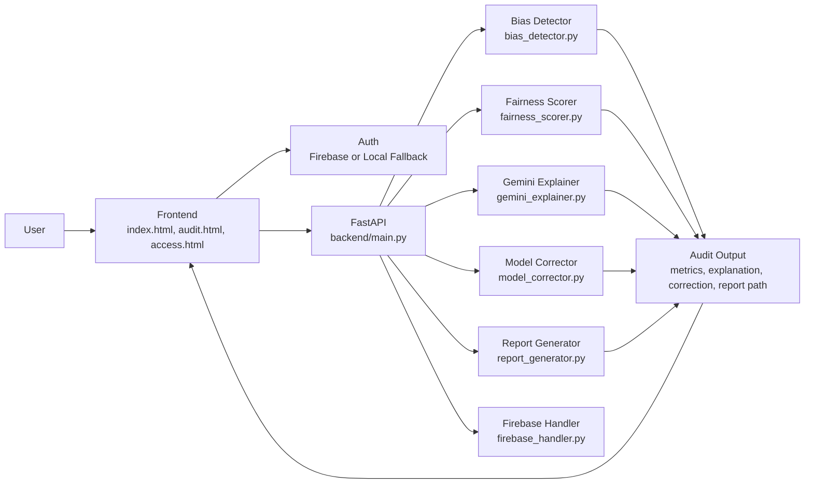
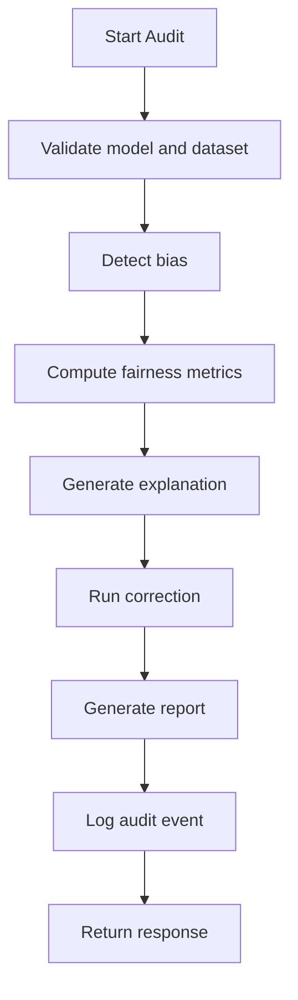

<div align="center">


<p>
  <a href="http://localhost:8000"></a>
  <a href="http://localhost:8080/health"></a>
  <a href="https://fairlens-india.onrender.com/health"></a>
  <a href="https://fastapi.tiangolo.com"></a>
  <a href="https://langchain-ai.github.io/langgraph/"></a>
</p>

<p>
  
  
  
  
</p>

</div>

---

## 🌈🧠 AI Mission Board

<table>
  <tr>
    <td width="33%"><b>🔮 Vision</b><br/>Fair and explainable AI before deployment</td>
    <td width="33%"><b>🎯 Challenge</b><br/>Unbiased AI decisions in automated systems</td>
    <td width="33%"><b>✅ Outcome</b><br/>Audit proof with correction and reports</td>
  </tr>
</table>

---

## 🧭⚡ Neural Navigation

| Module Track | Sections |
|---|---|
| 🟦 Story Layer | [AI Product Snapshot](#ai-product-snapshot), [Challenge Alignment](#challenge-alignment), [Impact Signals](#impact-signals) |
| 🟪 Human Layer | [Team and Contributors](#team-and-contributors) |
| 🟩 Platform Layer | [Live System Endpoints](#live-system-endpoints), [Feature Intelligence](#feature-intelligence) |
| 🟧 Engineering Layer | [Architecture Graph](#architecture-graph), [Pipeline Engine](#pipeline-engine), [Technical Modeling](#technical-modeling), [Evaluation Metrics](#evaluation-metrics), [API Gateway Surface](#api-gateway-surface), [Tech Stack Matrix](#tech-stack-matrix), [Integration Map](#integration-map), [Repository Topology](#repository-topology) |
| 🟨 Execution Layer | [Boot and Runbook](#boot-and-runbook), [Runtime Configuration Grid](#runtime-configuration-grid), [Demo Flow Script](#demo-flow-script) |
| 🟥 Evolution Layer | [Roadmap Radar](#roadmap-radar), [Special Thanks](#special-thanks), [Contribution Portal](#contribution-portal), [License](#license) |

---

## �📽️ Project Presentation & Demo

> 📺 Watch our full system in action and review our technical proposal.

| Resource | Link |
|---|---|
| **YouTube Demo** | [▶️ Watch Video Demo](https://youtu.be/pqv3RcTO4zc) |
| **Project Presentation** | [📄 View PDF](<./Cognitive Codes [Google Solution Challenge 2026] (1).pdf>) |

---

## �🌍🤖 AI Product Snapshot

> 🌐 FairLens India is an AI fairness intelligence platform for high-impact model decisions.

It answers three critical questions in one guided run:

- Is this model biased against sensitive groups?
- Why is this bias happening?
- Can fairness be improved with controlled tradeoff?

---

## 🎯🛡️ Challenge Alignment

> 🎯 Selected challenge: [Unbiased AI Decision] Ensuring Fairness and Detecting Bias in Automated Decisions.

<details>
<summary><b>Why this platform is a direct fit</b></summary>

- Detects sensitive-group bias in automated predictions.
- Explains risk patterns using SHAP-based contribution signals.
- Applies fairness correction and quantifies before and after deltas.
- Generates evidence-ready outputs for judges and reviewers.

</details>

---

## ⚡📊 Impact Signals

> ⚡ AI/ML value framed as measurable outcomes.

| Signal Area | Platform Outcome |
|---|---|
| 🟢 Fairness Visibility | Exposes group disparity through fairness metrics |
| 🔵 Explainability | Converts technical signals into narrative reasoning |
| 🟠 Corrective Action | Optimizes model fairness via constrained learning |
| 🟣 Governance Proof | Delivers PDF and JSON audit artifacts |

---

## 👥💫 Team and Contributors

> 👥 Team Name: Cognitive Codes

| Avatar | Contributor | Role | GitHub |
|---|---|---|---|
|  | Yashaswini V | Leader, Full-Stack and AI Engineer | [Yashaswini-V21](https://github.com/Yashaswini-V21) |
|  | Darshini KH | Core Member, Frontend and Backend Co-Builder | [DARSHINI-KH](https://github.com/DARSHINI-KH) |

---

## 🌐🔗 Live System Endpoints

> 🌈 Access nodes for local development and hosted verification.

| Environment | Endpoint | Usage |
|---|---|---|
| 🟦 Local Frontend | http://localhost:8000 | UI interaction and uploads |
| 🟩 Local API Health | http://localhost:8080/health | backend status check |
| 🟨 Local Counter | http://localhost:8080/counter | audit run counter |
| 🟪 Hosted Health | https://fairlens-india.onrender.com/health | deployment uptime check |

Routing behavior:

- environment-aware API routing via api-config.js
- localhost routes to local backend
- other host contexts route to hosted backend

---

## 🚀🧬 Feature Intelligence

> 🚀 Complete AI fairness delivery pipeline in the current build.

| Capability Block | Implemented Behavior |
|---|---|
| 🎨 Interface Experience | modern landing, auth, and audit workspace |
| 🔐 Auth Layer | Firebase auth with local fallback mode |
| ⚙️ Audit API | detect, explain, correct, and report workflow |
| 🧠 Bias Engine | SHAP attribution and sensitive bias flagging |
| 📏 Fairness Engine | Fairlearn metrics and correction strategy |
| 💬 Explanation Engine | Gemini response with deterministic fallback |
| 📄 Reporting Engine | PDF generation with before and after insights |
| 📊 Logging Engine | Firebase counter and local fallback storage |

---

## 🧠🏗️ Architecture Graph

> 🧠 Unified AI system map from user action to fairness artifact output.





---

## 🔁⚙️ Pipeline Engine

> 🔁 Neural audit timeline from ingestion to persistent output.

| Stage | Input | Compute Action | Output |
|---|---|---|---|
| 1. Ingestion | model + dataset files | validation and schema checks | parsed artifacts |
| 2. Detection | feature matrix + sensitive cols | SHAP analysis and bias scan | bias indicators |
| 3. Scoring | predictions + labels | DPD, EOD, EOP, disparity computation | fairness scorecard |
| 4. Explanation | metric deltas | Gemini or fallback narrative | explanation summary |
| 5. Correction | model + constraints | ExponentiatedGradient optimization | before and after metrics |
| 6. Reporting | unified audit state | PDF and JSON payload assembly | report artifacts |
| 7. Logging | metadata + count | Firebase or local persistence | traceable audit trail |

---

## 🧪📐 Technical Modeling

> 🧪 Core mathematical and system assumptions.

### Model Contract

- Python-serializable model file (.pkl)
- Required method: predict(X)
- Optional method: predict_proba(X) for richer SHAP behavior

### Fairness Metrics

- Demographic Parity Difference (DPD)
- Equalized Odds Difference (EOD)
- Equal Opportunity Difference (EOP)
- Selection rate by group
- Disparity ratio

### Rating Bands

- FAIR: < 0.05
- BORDERLINE: 0.05 to 0.10
- BIASED: > 0.10

### Correction Strategy

- Fairlearn ExponentiatedGradient as primary method
- DemographicParity default constraint
- EqualizedOdds optional path
- returns before and after metrics, accuracy shift, fairness improvement percent

### Explainability Strategy

- Gemini 2.0 Flash as primary explainer
- deterministic fallback narrative from metric deltas
- optional Hindi translation path

---

## 📊🎛️ Evaluation Metrics

> 📊 Confidence matrix for fairness and utility preservation.

| Dimension | Primary Metric | Healthy Direction |
|---|---|---|
| Group parity | DPD | lower gap |
| Error equity | EOD | lower divergence |
| Opportunity equity | EOP | similar TPR |
| Relative balance | disparity ratio | near 1.0 |
| Utility stability | accuracy before vs after | controlled drop |
| Fairness gain | improvement percent | positive increase |

---

## 🔐🌉 API Gateway Surface

> 🔐 Endpoint contract with configurable security envelope.

| Endpoint | Method | Responsibility |
|---|---|---|
| /health | GET | service health status |
| /counter | GET | audit counter retrieval |
| /audit | POST | full fairness audit pipeline |
| /correct | POST | correction-only execution |
| /report | GET | report usage guide |
| /report | POST | report generation from payload |

Security envelope:

- Bearer token validation using Firebase verify_id_token
- optional FAIRLENS_API_KEY request gate
- optional FIREBASE_AUTH_REQUIRED strict mode

---

## 🧩💠 Tech Stack Matrix

> 🧩 Layered AI platform stack for speed, traceability, and explainability.

| Layer | Technology Set | Purpose |
|---|---|---|
| Frontend | HTML5, CSS3, Vanilla JavaScript | interactive audit UI and orchestration |
| Auth | Firebase Auth Compat SDK | identity and token flow |
| Runtime | FastAPI, Uvicorn | backend services and endpoints |
| Data and ML | Pandas, NumPy, scikit-learn | model interoperability and data ops |
| Fairness and Explainability | SHAP, Fairlearn, Gemini API | bias detection, correction, and narrative reasoning |
| Reports and Persistence | ReportLab, Firebase Admin SDK | PDF outputs, logs, and counters |
| Workflow Control | LangGraph | orchestration and fallback sequencing |

---

## 🛠️🗺️ Integration Map

> 🛠️ Runtime and deployment ecosystem.

| Category | Integrations |
|---|---|
| Local Runtime | Python, HTTP server, Uvicorn |
| Deployment | Render |
| Auth and Logging | Firebase Auth, Firebase Admin |
| Explainability | SHAP, Gemini API |
| Fairness Correction | Fairlearn |
| Documentation | Markdown, Mermaid, ReportLab |

---

## 🗂️🌌 Repository Topology

> 🗂️ Active source topology for frontend, backend, and scripts.

```text
FairLens_India/
  index.html
  access.html
  audit.html
  script-v2.js
  audit-page.js
  auth-pages.js
  styles-v2.css
  audit-page.css
  auth-pages.css
  api-config.js
  firebase-config.js
  backend/
    main.py
    agents/
      audit_agent.py
    engine/
      bias_detector.py
      fairness_scorer.py
      gemini_explainer.py
      model_corrector.py
    utils/
      firebase_handler.py
      report_generator.py
  scripts/
    smoke_test.py
  samples/
  reports/
```

---

## ⚙️🚀 Boot and Runbook

> ⚙️ Quick-start command path for local execution.

### 1) Install dependencies

```bash
python -m pip install --upgrade pip setuptools wheel
python -m pip install -r requirements.txt
```

### 2) Start backend

```bash
python -m uvicorn backend.main:app --host 0.0.0.0 --port 8080 --reload
```

### 3) Start frontend

```bash
python -m http.server 8000
```

Open http://localhost:8000

### 4) Run smoke test

```bash
python scripts/smoke_test.py --base-url http://localhost:8080
```

Expected line: SMOKE TEST PASSED

### Readiness Checklist

| Checkpoint | Expected State |
|---|---|
| backend health | status ok |
| frontend serve | available on 8000 |
| audit run | upload and processing successful |
| report output | report path returned |

---

## 🔧🧠 Runtime Configuration Grid

> 🔧 Backend and frontend runtime variable map.

### Backend Variables

| Variable | Purpose |
|---|---|
| PORT | API runtime port |
| CORS_ORIGINS | allowed origins |
| FAIRLENS_API_KEY | optional API key gate |
| FIREBASE_AUTH_REQUIRED | strict auth toggle |
| GEMINI_API_KEY | Gemini access key |
| FIREBASE_PROJECT_ID | Firebase project mapping |
| FIREBASE_PRIVATE_KEY | Firebase service key |
| FIREBASE_CLIENT_EMAIL | Firebase service account |
| FAIRLENS_REPORT_DIR | report output directory |

### Frontend Variables

| Variable | Source |
|---|---|
| window.FAIRLENS_API_BASE_URL | api-config.js |
| window.FAIRLENS_FIREBASE_CONFIG | firebase-config.js |

---

## 🎬🌟 Demo Flow Script

> 🎬 Stage-ready run sequence for judging demonstrations.

1. start backend on port 8080
2. start frontend on port 8000
3. enter workspace using access and auth flow
4. upload model and dataset
5. run full fairness audit
6. present metrics and generated report artifacts

---

## 🧭📡 Roadmap Radar

> 🧭 Next expansion points for scale and policy maturity.

- multi-sensitive-feature correction in a single pass
- sector-specific policy presets and threshold templates
- batch audits for multiple models
- expanded compliance artifact bundle

---

## ✨🌸 Special Thanks

> ✨ Gratitude to the communities and tooling ecosystem powering this build.

- 🤖 AI assistant support for faster iteration
- 📚 ML community knowledge on fairness best practices
- 🎨 design inspiration from modern AI/SaaS products
- 🔧 open-source and platform ecosystem including GitHub, Render, Firebase
- 🎓 educators and mentors enabling practical implementation

---

## 🎯🪄 Contribution Portal

> 🎯 Contributions are welcome across fairness science, UX, and platform engineering.

Ways to contribute:

1. extend fairness metrics and correction constraints
2. add benchmark datasets and scenario tests
3. improve multilingual explanation quality
4. strengthen deployment reliability and observability

collaboration contact: hello@fairlens.dev

---

## 📄💎 License

> 📄 Open-source under MIT License.

See LICENSE for complete terms.

---

<div align="center">

<p>
  <span style="color:#22c55e;font-weight:800;">Fairness</span>
  <span style="color:#38bdf8;font-weight:800;">•</span>
  <span style="color:#a855f7;font-weight:800;">Transparency</span>
  <span style="color:#38bdf8;font-weight:800;">•</span>
  <span style="color:#f97316;font-weight:800;">Responsible AI</span>
</p>

<p>Contact: hello@fairlens.dev</p>

<p>Built for fair AI decisions in India.</p>

</div>
