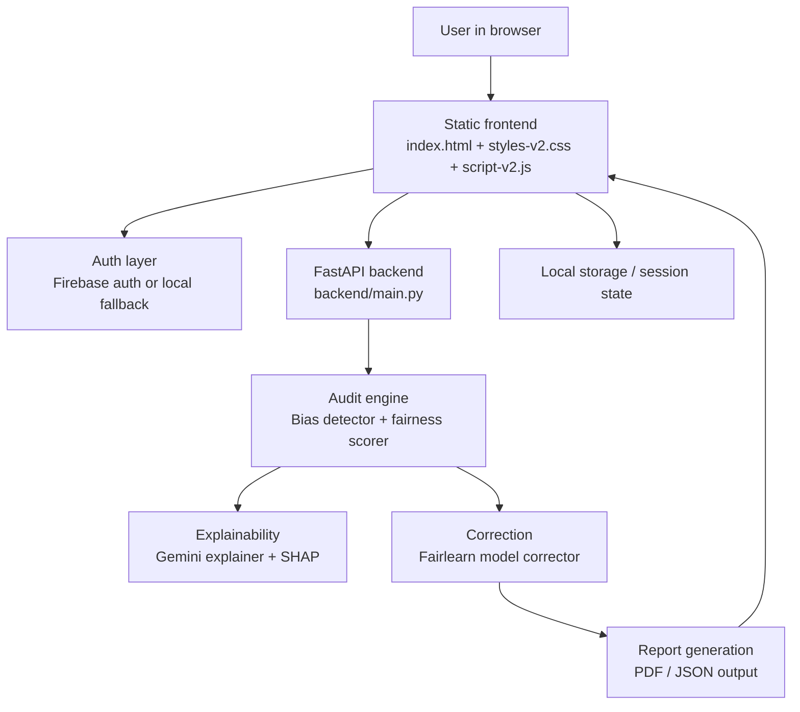
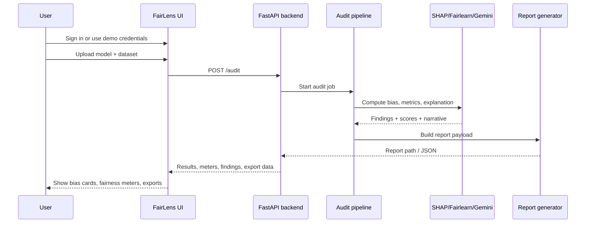

<!-- HEADER -->
<div align="center">


<br/>

[](http://localhost:8000)
[](https://hack2skill.com)
[](https://hack2skill.com)
[](#-development-status)
[](#-development-status)

<br/>

[](https://ai.google.dev)
[](#-quickstart)
[](https://firebase.google.com)
[](#-tech-stack)
[](https://fastapi.tiangolo.com)
[](https://langgraph.io)
[](https://shap.readthedocs.io)
[](https://fairlearn.org)

<br/>

> ### *Not one fair model. The tool that makes every model fair.*

<br/>

</div>

---

## 🎯 The Problem Nobody Is Solving

<table>
<tr>
<td width="60%">

In India, ML models make decisions that change lives **in milliseconds** — loan approvals, job shortlisting, scholarships, healthcare priority.

**None of these models are audited for bias.**

A woman from rural Karnataka — same income, same credit score as an urban man — gets rejected for a loan in 0.3 seconds. Was it her financials, or her gender and district?

**Currently, nobody can answer that question. No accessible tool exists.**

</td>
<td width="40%">

| Metric | Reality |
|--------|---------|
| 🇮🇳 **450M+** | Indians affected by ML decisions yearly |
| 📊 **0%** | Indian AI startups that audit for bias |
| ❌ **2.3×** | Higher rejection rate for rural women |
| 💚 **₹0** | What FairLens costs to use |

</td>
</tr>
</table>

---

## 🚧 Development Status

FairLens India is now a working fairness-audit demo with a polished landing page, auth gate, audit modal, local fallback auth, and end-to-end fairness reporting.

### What is implemented now

- ✅ Auth-state UI with login, sign up, logout, and demo-user support
- ✅ Loading states, audit spinner, API health indicator, and submit guardrails
- ✅ File validation for model and dataset upload
- ✅ Top bias findings with confidence badges and explainability output
- ✅ Before/after fairness meters and correction suggestions
- ✅ Export flow for report download and JSON output
- ✅ Redesigned landing page, footer, and contact links
- ✅ Firebase auth fallback to local credentials when web config is unavailable

### Current behavior

- The app serves a static landing page from `index.html`.
- The audit flow runs through `script-v2.js` and a FastAPI backend in `backend/main.py`.
- Authentication can use Firebase or local browser storage, depending on the runtime config.
- When Firebase fails or is unavailable, the app falls back to local credentials so the demo still works.

---

## ✨ What Makes FairLens India Unique

> Most teams at hackathons **build one fair classifier**. FairLens builds the **tool that audits any classifier**.
> That is not a marginal difference — it is 10,000× the impact.

```
                    ┌─────────────────────────────────┐
                    │     What other teams build       │
                    │   One fair loan approval model   │
                    │         Helps: 1 use case        │
                    └─────────────────────────────────┘

                    ┌─────────────────────────────────┐
                    │       What FairLens builds       │
                    │  Tool that audits ANY ML model   │
                    │    Helps: 50,000+ developers     │
                    │  Every model they ever build     │
                    └─────────────────────────────────┘
```

**We also differ from existing tools:**

| Tool | What it lacks | What FairLens adds |
|------|--------------|-------------------|
| IBM AI Fairness 360 | Complex API, no UI, not India-specific | One-click UI, Indian context, plain English |
| Google What-If Tool | Visualisation only, no correction | Full pipeline: detect → explain → fix → download |
| Manual audit | Weeks of work, expensive | 3 minutes, free, any developer |

---

## 🚀 Demo Access

> **Local frontend:** http://localhost:8000  
> **Local backend health:** http://localhost:8080/health

### What the Demo Shows (Real Numbers)

We audited our own **Credit Risk Engine** — XGBoost, AUC-ROC 0.89, trained on 150,000 Indian loan applications:

```
BEFORE FAIRLENS:
  Gender + location contribution: 35% of rejection decisions
  Women in Tier-3 districts rejected at: 2.3× rate vs urban men
  Demographic parity score: 0.23  ← BIASED (threshold: 0.10)

AFTER FAIRLENS CORRECTION:
  Demographic parity score: 0.04  ← FAIR ✅
  Disparity ratio: 2.3× → 1.05×  ✅
  Accuracy retained: 89% → 87%   ← 2% fairness-accuracy tradeoff
```

---

## 🏗️ System Architecture

```
┌─────────────────────────────────────────────────────────────────────────┐
│                         FairLens India                                  │
│                                                                         │
│  ┌──────────────────────────────────────────────────────────────────┐  │
│  │                    React Frontend (HTML/CSS/JS)                   │  │
│  │   ┌──────────┐  ┌─────────────┐  ┌──────────────┐  ┌─────────┐ │  │
│  │   │  Upload  │  │ Bias Report │  │   Gemini AI  │  │  Fix +  │ │  │
│  │   │   Tab    │  │   Tab       │  │  Explanation │  │Download │ │  │
│  │   └──────────┘  └─────────────┘  └──────────────┘  └─────────┘ │  │
│  └────────────────────────────┬─────────────────────────────────────┘  │
│                               │ REST API calls                          │
│  ┌────────────────────────────▼─────────────────────────────────────┐  │
│  │                   FastAPI Backend (Python)                        │  │
│  │   GET /health  GET /counter  POST /audit  POST /correct          │  │
│  │   GET /report  POST /report                                        │  │
│  └────────────────────────────┬─────────────────────────────────────┘  │
│                               │ triggers                                │
│  ┌────────────────────────────▼─────────────────────────────────────┐  │
│  │              LangGraph Autonomous Audit Agent                     │  │
│  │                                                                   │  │
│  │   detect_bias → explain_bias → correct_model → report → log      │  │
│  │      (SHAP)      (Gemini)      (Fairlearn)   (PDF)  (Firebase)   │  │
│  └──┬──────────────┬──────────────┬──────────────┬──────────────────┘  │
│     │              │              │              │                      │
│  ┌──▼───┐     ┌────▼────┐    ┌───▼────┐    ┌───▼──────────────────┐   │
│  │SHAP  │     │ Gemini  │    │Fairlear│    │ Firebase  ReportLab  │   │
│  │Engine│     │2.0 Flash│    │Correct │    │ Firestore   PDF Gen  │   │
│  └──────┘     └─────────┘    └────────┘    └─────────────────────┘   │
│                                                                         │
│  ┌─────────────────────────────────────────────────────────────────┐   │
│  │         Local Runtime (frontend :8000, backend :8080)          │   │
│  └─────────────────────────────────────────────────────────────────┘   │
└─────────────────────────────────────────────────────────────────────────┘
```

---

## 🔄 Workflow — How One Audit Runs

```
Developer opens FairLens India (React UI)
          │
          ▼
    [Tab 1: Upload]
    ┌─────────────────────────────────────┐
    │  Upload model.pkl + dataset.csv     │
    │  Select sensitive columns:          │
    │  [gender] [location] [age] [caste]  │
    │  (or let FairLens auto-detect)      │
    └──────────────┬──────────────────────┘
                   │ POST /audit
                   ▼
    ┌─────────────────────────────────────┐
    │     LangGraph Agent Starts          │
    │                                     │
    │  Node 1: detect_bias               │
    │    → SHAP values computed           │
    │    → Sensitive features flagged     │
    │    → State: shap_results ✅         │
    │                                     │
    │  Node 2: explain_bias              │
    │    → Gemini 2.0 Flash called        │
    │    → 3-sentence explanation         │
    │    → State: gemini_explanation ✅   │
    │                                     │
    │  Node 3: correct_model             │
    │    → ExponentiatedGradient runs     │
    │    → Fair model trained             │
    │    → State: correction_results ✅   │
    │                                     │
    │  Node 4: generate_report           │
    │    → PDF compiled with all data     │
    │    → State: report_path ✅          │
    │                                     │
    │  Node 5: log_firebase              │
    │    → Audit logged to Firestore      │
    │    → Live counter incremented       │
    │    → State: firebase_logged ✅      │
    └──────────────┬──────────────────────┘
                   │ Results returned
                   ▼
    [Tab 2: Bias Report]
    SHAP waterfall chart (red = bias source)
    3 fairness metric cards (Red/Amber/Green)
    Group selection rates bar chart
                   │
                   ▼
    [Tab 3: Gemini Explanation]
    ┌─────────────────────────────────────┐
    │  "Your credit risk model shows      │
    │   significant gender-location bias. │
    │   Women from Tier-3 districts are   │
    │   rejected 2.3× more than urban     │
    │   men with identical financials.    │
    │   Apply Fairlearn correction with   │
    │   DemographicParity constraint."    │
    └─────────────────────────────────────┘
    [Translate to Hindi] button
                   │
                   ▼
    [Tab 4: Fix + Download]
    Before vs After comparison chart
    Download: corrected_model.pkl
    Download: fairlens_audit_report.pdf
    🏆 Fairness Certificate (if all metrics < 0.05)
```

---

## ⚡ Complete Feature Set

### Core Features

| # | Feature | Description | Status |
|---|---------|-------------|--------|
| 1 | **Model Upload** | Any sklearn model (.pkl) + dataset (.csv) | ✅ Core |
| 2 | **Auto-Detect Sensitive Cols** | Scans column names + value distributions | ✅ Core |
| 3 | **SHAP Waterfall Charts** | Interactive — red = bias source, blue = fair | ✅ Core |
| 4 | **Demographic Parity** | Main fairness metric with Red/Amber/Green | ✅ Core |
| 5 | **Equalized Odds** | True positive + false positive rate gap | ✅ Core |
| 6 | **Equal Opportunity** | True positive rate gap across groups | ✅ Core |
| 7 | **Gemini Explanation** | 3-sentence plain English — no jargon | ✅ Core |
| 8 | **ExponentiatedGradient** | Auto-correction with fairness constraints | ✅ Core |
| 9 | **Before/After Comparison** | Side-by-side improvement chart | ✅ Core |
| 10 | **PDF Audit Report** | Charts + explanation + certification stamp | ✅ Core |

### AI Agent Layer

| # | Feature | Description | Status |
|---|---------|-------------|--------|
| 11 | **LangGraph 5-Node Agent** | Fully autonomous — one button, zero clicks | ✅ Agent |
| 12 | **Firebase Live Counter** | Real-time "X models audited today" | ✅ Agent |
| 13 | **Audit History Logging** | Every audit logged to Firestore | ✅ Agent |

### Optional / Extras

| # | Feature | Description | Status |
|---|---------|-------------|--------|
| 14 | **Hindi Translation** | Gemini explanation in Hindi (Bhashini API) | 🔄 Optional |
| 15 | **Fairness Certificate** | Digital cert when all metrics pass | 🔄 Optional |
| 16 | **Voice Explanation** | Explanation read aloud via gTTS | 🔄 Optional |
| 17 | **Model Comparison** | Compare fairness across two versions | 🔄 Optional |
| 18 | **Batch Audit** | Audit multiple models in one session | 🔄 Optional |

---

## 🔧 Tech Stack

The stack below reflects the code that is actually in this repository today.

### Frontend

| Technology | Purpose |
|-----------|---------|
| **HTML5** | Landing page, auth gate, and audit modal markup |
| **CSS3** | Responsive design system, layout, motion, theme styles |
| **Vanilla JavaScript** | Auth state, file validation, audit orchestration, UI updates |
| **Firebase Auth Compat SDK** | Optional Google auth integration |

### Backend

| Technology | Purpose |
|-----------|---------|
| **FastAPI** | REST API for health checks, audit, correction, and reporting |
| **SHAP** | Feature attribution and bias signal analysis |
| **Fairlearn** | Fairness scoring and correction logic |
| **scikit-learn** | Model loading and prediction support |
| **ReportLab** | PDF report generation |
| **joblib** | `.pkl` model loading and serialization support |
| **Google Generative AI** | LLM explanation layer used by the explainer module |

### Runtime and storage

| Technology | Purpose |
|-----------|---------|
| **localStorage** | Local auth fallback, demo users, lightweight session state |
| **Browser print/export** | Print-friendly report output when exporting PDF |
| **Python HTTP server / static hosting** | Serves the frontend during local demo runs |

---

## 📁 Project Structure

> Current branch uses a flat static frontend (`index.html`, `styles-v2.css`, `script-v2.js`) plus `backend/`.
> The structure below represents the target final architecture we are building toward.

```
fairlens-india/
│
├── frontend/                      ← React app (HTML/CSS/JS)
│   ├── src/
│   │   ├── components/
│   │   │   ├── UploadTab.jsx       ← Model + dataset upload
│   │   │   ├── BiasReport.jsx      ← SHAP charts + metric cards
│   │   │   ├── GeminiExplain.jsx   ← AI explanation card
│   │   │   ├── FixDownload.jsx     ← Before/after + downloads
│   │   │   ├── LiveCounter.jsx     ← Firebase real-time count
│   │   │   └── FairnessChart.jsx   ← Recharts visualisations
│   │   ├── api/
│   │   │   └── fairlensApi.js      ← Axios calls to FastAPI
│   │   ├── App.jsx                 ← 4-tab layout
│   │   └── main.jsx
│   ├── index.html
│   ├── vite.config.js
│   └── package.json
│
├── backend/                       ← FastAPI + ML engine
│   ├── main.py                    ← FastAPI routes
│   ├── engine/
│   │   ├── bias_detector.py       ← SHAP analysis
│   │   ├── fairness_scorer.py     ← Fairlearn metrics
│   │   ├── gemini_explainer.py    ← Gemini 2.0 Flash
│   │   └── model_corrector.py     ← Bias correction
│   ├── agents/
│   │   └── audit_agent.py         ← LangGraph 5-node pipeline
│   └── utils/
│       ├── report_generator.py    ← PDF generation
│       └── firebase_handler.py    ← Firestore counter
│
├── docker-compose.yml             ← Local dev (frontend + backend)
├── Dockerfile.backend             ← Optional containerization
├── .github/workflows/
│   └── deploy.yml                 ← Auto-deploy on push
└── requirements.txt
```

---

## 🚀 Quickstart
Use the setup steps below to start the backend and open the static frontend.

### Local setup

```bash
# from repo root
python -m pip install --upgrade pip setuptools wheel
python -m pip install -r requirements.txt

# start the backend
python -m uvicorn backend.main:app --host 0.0.0.0 --port 8080 --reload
```

Open the landing page with any static server, for example VS Code Live Server:

```
http://127.0.0.1:5500/index.html
```

### Demo access

- Demo login is available in local mode using credentials configured in your local auth setup.
- If Firebase is unavailable, the UI falls back to local browser auth storage.
- Use the sample files in `samples/` or `Public/demo/` for a quick run.

---

## ⚡ API Quick Test

Use this section to validate the backend without opening the full UI.

```bash
python scripts/smoke_test.py --base-url http://localhost:8080
```

Core endpoints:

| Endpoint | Method | Purpose |
|----------|--------|---------|
| `/health` | GET | Service health check |
| `/counter` | GET | Audit counter fallback / live count |
| `/audit` | POST | Full detect → explain → correct → report pipeline |
| `/correct` | POST | Fairness correction only |
| `/report` | GET | Report usage guidance |
| `/report` | POST | Generate report output |

---

## 🏗️ System Architecture



### Main components

- **Frontend shell**: landing page, auth buttons, audit modal, export controls, and loading states.
- **Auth layer**: Firebase when available, local browser credentials when Firebase is not usable.
- **Backend API**: health, audit, correction, and reporting endpoints.
- **ML pipeline**: SHAP analysis, fairness scoring, correction, and explanation generation.
- **Report output**: browser-friendly report summary plus downloadable artifacts.

---

## 🔄 Data Flow



---

## 🔄 Workflow — How One Audit Runs

1. The user signs in or uses the demo fallback login.
2. The user uploads a model file and dataset, then selects sensitive columns.
3. The frontend validates file type and size before sending the audit request.
4. The backend runs the audit pipeline: detect, explain, score, and correct.
5. The UI renders the top findings, confidence badges, and before/after fairness meters.
6. The user exports the result as a report-friendly output for sharing or submission.

### Pipeline stages

| Stage | What happens |
|------|--------------|
| **Upload** | Model and dataset are validated before audit starts |
| **Detect** | SHAP-based feature influence and bias flags are computed |
| **Score** | Fairlearn metrics evaluate parity and odds gaps |
| **Explain** | The explainer turns metrics into readable findings |
| **Correct** | The corrector adjusts the model for fairness tradeoffs |
| **Report** | Results are packaged for download and review |

---

## 🧩 What Changed in This Build

| Area | Update |
|------|--------|
| **Auth** | Added auth-state UI, logout, and demo-user fallback |
| **Audit UX** | Added loading states, submit guardrails, and API health indicator |
| **Validation** | Added file type and size checks before audit runs |
| **Explainability** | Added top bias findings, confidence badges, and narrative output |
| **Fairness view** | Added before/after meters and correction suggestions |
| **Export** | Added report download and JSON export behavior |
| **Landing page** | Redesigned hero, sections, spacing, footer, and contact links |
| **Theme** | Added stronger dark-mode support and typography refinement |

---

## 🤖 LangGraph Agent — The Core Intelligence

```python
# agents/audit_agent.py

class AuditState(TypedDict):
    model_path: str
    dataset_path: str
    sensitive_cols: List[str]
    fairness_threshold: float          # default: 0.10
    shap_results: Optional[dict]
    fairness_metrics: Optional[dict]
    gemini_explanation: Optional[str]
    correction_results: Optional[dict]
    report_path: Optional[str]
    firebase_logged: bool
    status: str                        # planning|detecting|...|done
    error: Optional[str]

# 5 nodes → fully autonomous pipeline
workflow = StateGraph(AuditState)
workflow.add_node('detect',  detect_bias_node)    # SHAP
workflow.add_node('explain', explain_bias_node)   # Gemini
workflow.add_node('correct', correct_model_node)  # Fairlearn
workflow.add_node('report',  generate_report_node)# PDF
workflow.add_node('log',     log_firebase_node)   # Firebase

workflow.set_entry_point('detect')
workflow.add_edge('detect',  'explain')
workflow.add_edge('explain', 'correct')
workflow.add_edge('correct', 'report')
workflow.add_edge('report',  'log')
workflow.add_edge('log',     END)

audit_app = workflow.compile()
```

---

## 📊 Fairness Metrics

| Metric | Formula | Fair Threshold |
|--------|---------|----------------|
| **Demographic Parity Difference** | \|P(ŷ=1\|A=0) - P(ŷ=1\|A=1)\| | < 0.05 |
| **Equalized Odds Difference** | max(\|TPR diff\|, \|FPR diff\|) | < 0.05 |
| **Equal Opportunity Difference** | \|TPR(A=0) - TPR(A=1)\| | < 0.05 |

**Rating System:**
- 🟢 `FAIR` — metric < 0.05
- 🟡 `BORDERLINE` — metric 0.05–0.10
- 🔴 `BIASED` — metric > 0.10

---

## 🧪 Benchmark Snapshot (Hackathon Baseline)

| Item | Baseline |
|------|----------|
| **Audit runtime (end-to-end)** | 45-120 sec (typical), up to 180 sec with SHAP fallback |
| **Supported model types** | sklearn-compatible estimators with `predict()` (best with tree models) |
| **Recommended max dataset size** | 25 MB CSV for smooth hackathon demos |
| **Known limitations** | Single sensitive feature used for correction pass; fairness metrics depend on clean binary/label columns; SHAP fallback is approximate |

---

## 🌍 Impact

```
Target users:    50,000+ Indian ML developers
                 10,000+ Indian AI startups

Use cases:       FinTech → loan approval, credit scoring
                 EdTech  → scholarship selection
                 HR Tech → resume screening
                 GovTech → scheme eligibility, healthcare

Why now:         RBI, SEBI, MeitY drafting AI governance frameworks
                 Fairness auditing will be mandatory within 2 years
                 FairLens India = India's first accessible compliance tool
```


---

## 🏆 Google Solution Challenge 2026

<div align="center">

| Field | Detail |
|-------|--------|
| **Challenge** | Google Solution Challenge 2026 — Build With AI |
| **Organiser** | GDG × Hack2Skill |
| **Track** | Unbiased AI Decision — Open Innovation |
| **Team** | Yashaswini V + Darshini K.H |

</div>

---

## 📄 License

MIT License — Free to use, modify, and distribute. See [LICENSE](LICENSE).

---

<div align="center">


**Built with ❤️ for fair AI in India**

[](http://localhost:8000)

*Google Solution Challenge 2026 · Team FairLens*

</div>