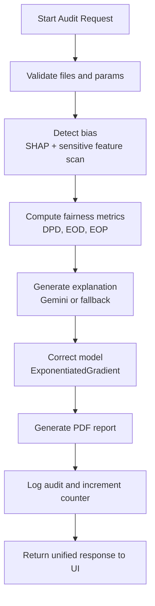
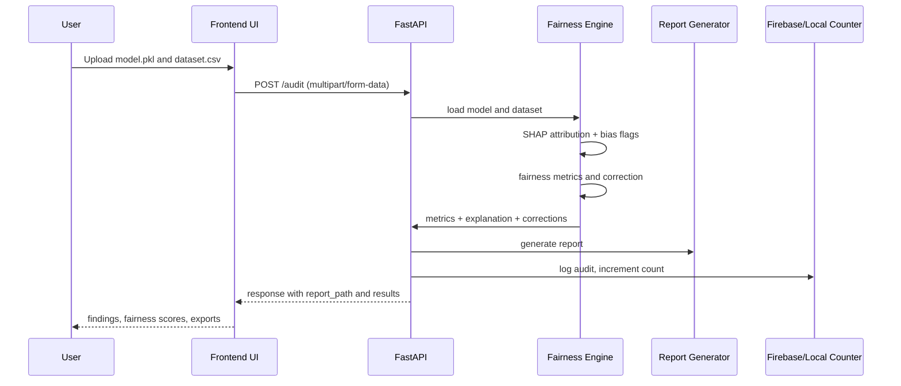

<!-- HEADER -->
<div align="center">


<br/>

[](http://localhost:8000)
[](http://localhost:8080/health)
[](https://fairlens-india.onrender.com/health)
[](https://fastapi.tiangolo.com)
[](https://langchain-ai.github.io/langgraph/)

<br/>

> ### Not one fair model. The platform that audits any model.

</div>

---

## Problem and Vision

FairLens India is an AI fairness audit platform for model teams building high-impact decision systems in India.

It answers three practical questions in one run:
- Is this model biased for protected groups?
- Why is that bias happening?
- Can we correct it with measurable fairness gain and controlled accuracy tradeoff?

---

## Live URLs

### Local runtime

- Frontend: http://localhost:8000
- Backend health: http://localhost:8080/health
- Counter endpoint: http://localhost:8080/counter

### Hosted runtime

- Backend (Render): https://fairlens-india.onrender.com
- Backend health (Render): https://fairlens-india.onrender.com/health

Note:
- Frontend API routing is environment-aware via api-config.js.
- Local hostnames use localhost:8080.
- Non-local hostnames default to the Render backend URL.

---

## What Is Implemented

- Static frontend with modern landing experience, auth gate, and audit workspace
- Access flow with Firebase auth when configured and local fallback when unavailable
- Full fairness audit through FastAPI: upload model plus dataset, detect, explain, correct, report
- SHAP-based bias attribution and sensitive feature contribution analysis
- Fairlearn-based fairness metrics and correction pipeline
- Gemini 2.0 Flash explanation layer with deterministic fallback
- PDF report generation with verdict, findings, before/after metrics, and certification note
- Firebase audit logging and live counter with local fallback when Firebase is not configured

---

## System Architecture


---

## Audit Workflow Diagram



---

## Data and System Flow Diagram



---

## Technical Modeling

### 1) Detection Model Interface

Expected model contract:
- Python-serializable model file (.pkl)
- Supports predict(X)
- predict_proba(X) is used when available for richer SHAP behavior

### 2) Fairness Metrics

- Demographic Parity Difference (DPD)
- Equalized Odds Difference (EOD)
- Equal Opportunity Difference (EOP)
- Selection rate by group
- Disparity ratio

Rating thresholds used in scoring:
- FAIR: value < 0.05
- BORDERLINE: 0.05 to 0.10
- BIASED: value > 0.10

### 3) Correction Strategy

- Primary correction method: Fairlearn ExponentiatedGradient
- Constraint: DemographicParity by default (EqualizedOdds optional by code path)
- Returns:
  - before_metrics
  - after_metrics
  - accuracy_before
  - accuracy_after
  - fairness_improvement_pct

### 4) Explainability Strategy

- Primary: Gemini 2.0 Flash with strict 3-sentence response shape
- Fallback: deterministic explanation using metric deltas and disparity ratio
- Optional Hindi translation path available through the explainer utility

---

## API Surface

| Endpoint | Method | Purpose |
|---|---|---|
| /health | GET | Service status check |
| /counter | GET | Audit counter from Firebase or local fallback |
| /audit | POST | End-to-end detect -> explain -> correct -> report |
| /correct | POST | Correction-only path |
| /report | GET | Report usage guidance |
| /report | POST | Generate report from payload |

Security behavior:
- Supports Bearer token validation via Firebase verify_id_token
- Optional FAIRLENS_API_KEY header gate
- Optional FIREBASE_AUTH_REQUIRED strict mode

---

## Tech Stack

### Frontend

| Technology | Usage |
|---|---|
| HTML5 | Page structure (landing, access, audit) |
| CSS3 | Responsive UI, visual theme, layout |
| Vanilla JavaScript | UI logic, auth state, upload flow, API orchestration |
| Firebase Auth Compat SDK | Optional Google/email auth mode |

### Backend and AI

| Technology | Usage |
|---|---|
| FastAPI + Uvicorn | API service and runtime |
| Pandas + NumPy | Data processing |
| scikit-learn | Model compatibility and baseline ops |
| SHAP | Feature attribution and bias contribution |
| Fairlearn | Metrics and fairness correction |
| Google Generative AI | Explanation generation (Gemini 2.0 Flash) |
| ReportLab | PDF audit report generation |
| Firebase Admin SDK | Counter and audit log persistence |
| LangGraph | Agent-style workflow orchestration with fallback graph |

---

## Project Structure (Current)

```text
FairLens_India/
  index.html
  access.html
  audit.html
  script-v2.js
  audit-page.js
  auth-pages.js
  styles-v2.css
  audit-page.css
  auth-pages.css
  api-config.js
  firebase-config.js
  backend/
    main.py
    agents/
      audit_agent.py
    engine/
      bias_detector.py
      fairness_scorer.py
      gemini_explainer.py
      model_corrector.py
    utils/
      firebase_handler.py
      report_generator.py
  scripts/
    smoke_test.py
  samples/
  reports/
```

---

## Setup Guide

### 1) Install dependencies

```bash
python -m pip install --upgrade pip setuptools wheel
python -m pip install -r requirements.txt
```

### 2) Start backend

```bash
python -m uvicorn backend.main:app --host 0.0.0.0 --port 8080 --reload
```

### 3) Start frontend (static)

```bash
python -m http.server 8000
```

Open:
- http://localhost:8000

### 4) Run smoke test

```bash
python scripts/smoke_test.py --base-url http://localhost:8080
```

Expected success line:
- SMOKE TEST PASSED

---

## Environment Configuration

### Backend env vars

- PORT
- CORS_ORIGINS
- FAIRLENS_API_KEY
- FIREBASE_AUTH_REQUIRED
- GEMINI_API_KEY
- FIREBASE_PROJECT_ID
- FIREBASE_PRIVATE_KEY
- FIREBASE_CLIENT_EMAIL
- FAIRLENS_REPORT_DIR

### Frontend runtime config

- window.FAIRLENS_API_BASE_URL from api-config.js
- window.FAIRLENS_FIREBASE_CONFIG from firebase-config.js

---

## Clean Demo Run (Recommended)

1. Start backend on 8080.
2. Start frontend on 8000.
3. Open access page and enter workspace (Firebase or local mode).
4. Upload model and dataset.
5. Run full audit.
6. Verify report path and export JSON/PDF output.

---

## Roadmap

- Multi-sensitive-feature correction in a single pass
- Better threshold tuning UI and policy presets
- Batch audit for multiple models
- Extended compliance pack for regulated sectors

---

## License

MIT License. See LICENSE.

---

<div align="center">


Built for fair AI decisions in India.

</div>
